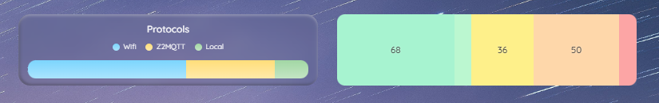
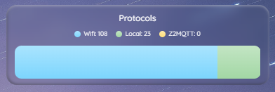
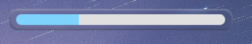
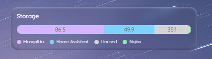
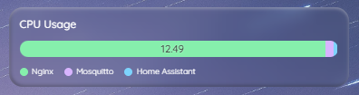

# Stacked Bar Card

A stacked bar card (horizontal or vertical) where each segment represents an entity's numeric value with configurable colors, gradients, and ordering.

Possible use-cases include storage usage, progress and timer bars, cpu usage, or just a pie chart that fits better into a grid themed dashboard.



## Installation

### HACS (recommended) 

Now in HACS 🎉

<a href="https://my.home-assistant.io/redirect/hacs_repository/?owner=kattcrazy&category=plugin&repository=stacked-bar-card" target="_blank" rel="noreferrer noopener"></a>

### Manual

1. Download `stacked-bar-card.js` from the [releases](https://github.com/kattcrazy/Stacked-Bar-Card/releases) page
2. Place it in your `config/www/` folder
3. Add the resource in the Lovelace config:
```yaml
resources:
  - url: /local/stacked-bar-card.js
    type: module
```

## Configuration

### Card options

All options support Jinja templates (strings containing `{{ }}`).

| Option | Type | Default | Description |
|--------|------|---------|-------------|
| `alignment` | `left`, `center`, `right` | `left` | Horizontal alignment for both title and legend |
| `show_title` | boolean | `true` | Show title |
| `title` | string | — | Card title text |
| `title_position` | `top`, `bottom` | `top` | Title placement |
| `show_legend` | boolean | `true` | When true, the legend row is shown only if at least one of `show_state`, `show_name`, or `show_unit` uses `legend` or `both` |
| `legend_position` | `top`, `bottom` | `bottom` | Legend placement |
| `show_state` | `bar`, `legend`, `both`, `none` | `legend` | Where to show entity values |
| `show_name` | `bar`, `legend`, `both`, `none` | `legend` | Where to show entity names |
| `show_unit` | `bar`, `legend`, `both`, `none` | `none` | Where to show units. Ignored when `show_state` is `none`. |
| `unit_source` | `automatic`, `custom` | `automatic` | `automatic`: each segment uses that entity’s `unit_of_measurement`. `custom`: use `unit_custom` for every segment. |
| `unit_custom` | string | — | Unit text when `unit_source` is `custom` (e.g. `kWh`, `%`). |
| `sort` | `abc`, `cba`, `highest`, `lowest`, `custom` | `highest` | Segment order (left → right) |
| `layout` | `horizontal`, `vertical` | `horizontal` | Bar direction; vertical stacks bottom to top |
| `bar_radius` | number | theme | Bar segment border-radius (px); omit for theme default |
| `gradient` | `none`, `inset`, `bevel`, `left`, `right`, `top`, `bottom` | `none` | Gradient direction |
| `fill_card` | boolean | `false` | Remove card background; bar fills grid cell; hides title/legend |
| `entities` | array | `[]` | Entity list (see below) |

### Entity options

| Option | Type | Default | Description |
|--------|------|---------|-------------|
| `entity` | string | required | Entity ID, Jinja template, or hardcoded number |
| `name` | string | — | Override name; omit to use friendly name. Supports Jinja. |
| `color` | string | auto | Hex (e.g. `#FF0000`) or HA variable. Supports Jinja. |
| `order` | number | — | Used when `sort: custom`. Supports Jinja. |

Entities must have numeric values (from entity state or from a Jinja template in `entity`). Proportions are computed from the sum.


### Full config & options

For your copy-paste convenience!


```yaml
type: custom:stacked-bar-card

alignment: left/center/right
show_title: true/false
title: Energy Usage
title_position: top/bottom

show_legend: true/false
legend_position: top/bottom

show_state: legend/bar/both/none
show_name: legend/bar/both/none

show_unit: legend/bar/both/none   # omitted or none when show_state is none
unit_source: automatic/custom
unit_custom: '%'                 # only when unit_source is custom

sort: abc/cba/highest/lowest/custom
layout: horizontal/vertical

bar_radius: 8                # omit for theme default
gradient: none/inset/bevel/left/right/top/bottom
fill_card: true/false

entities:
  - entity: sensor.grid_usage  # Or use Jinja templating
    name: Grid
    color: '#4472C4'
    order: 1 # If using sort: custom
```


## Examples

### Communication Protocols



```yaml
type: custom:stacked-bar-card
show_legend: true
show_state: legend
sort: highest
entities:
  - entity: sensor.wifi_devices # Your entity here
    name: Wifi
    color: "#7CD5FD"
  - entity: sensor.local_devices # Your entity here
    name: Local
    color: "#A2D7A4"
  - entity: sensor.z2mqtt_devices # Your entity here
    name: Z2MQTT
    color: "#FFDE7A"
legend_position: top
title_position: top
gradient: bottom
title: Protocols
grid_options:
  columns: 12
  rows: 2.5
fill_card: false
show_title: true
alignment: center
bar_radius: 13

```

<details>
<summary>How I got those sensors</summary>

Here's the configuration code used to get the sensors in the example above. It uses the labels assigned to devices.

```yaml

template:
  - sensor:
      - name: Z2MQTT Devices
        state: "{{ label_devices('Z2MQTT') | count }}"

      - name: Local Devices
        state: "{{ label_devices('Local') | count }}"

      - name: WIFI Devices
        state: "{{ label_devices('WIFI') | count }}"

      - name: Unlabelled Devices
        state: >
          {{
            states('sensor.devices') | int
            - states('sensor.z2mqtt_devices') | int
            - states('sensor.local_devices') | int
            - states('sensor.wifi_devices') | int
          }}

```

</details>

### Progress Bar



```yaml
type: custom:stacked-bar-card
entities:
  - entity: "{{ states('sensor.percent_finished') | float }}" # Your entity here
    name: Completed
    color: '#7DD3FC'  
    order: 1
  - entity: "{{ 100 - states('sensor.percent_finished') | float }}" # Your entity here
    name: Remaining
    color: '#E0E0E0' # Paler version of chosen colour here
    order: 2
show_legend: false
show_state: none
sort: custom
```

### Storage usage



```yaml
type: custom:stacked-bar-card
title:  Storage
entities:
  - entity: sensor.docker_homeassistant_memory # Your entity here
    name: Home Assistant
    color: "#7DD3FC"
  - entity: sensor.docker_nginx_memory # Your entity here
    name: Nginx
    color: "#86EFAC"
  - entity: sensor.docker_mosquitto_memory # Your entity here
    name: Mosquitto 
    color: "#D8B4FE"
  - entity: >-
      {{ states('sensor.total_storage') | float
      - states('sensor.docker_homeassistant_memory') | float
      - states('sensor.docker_nginx_memory') | float
      - states('sensor.docker_mosquitto_memory') | float }}
    name: Unused 
    color: "#D4D4D4"
sort: highest
show_state: bar
```

### CPU usage



```yaml
type: custom:stacked-bar-card
title: CPU Usage
entities:
  - entity: sensor.docker_homeassistant_cpu # Your entity here
    name: Home Assistant
    color: "#7DD3FC"
  - entity: sensor.docker_nginx_cpu  # Your entity here
    name: Nginx
    color: "#86EFAC"
  - entity: sensor.docker_mosquitto_cpu # Your entity here
    name: Mosquitto
    color: "#D8B4FE"
sort: highest
show_state: bar
```

## License

This project uses the [GNU General Public License v3.0](https://www.gnu.org/licenses/gpl-3.0.html). See [LICENSE](LICENSE) for the full legal text. In short: you can use, change, and share it freely. If you distribute a modified version, you must offer it under the same license and share the source too, so the work (and its derivatives) stay open. You cannot take this code, tweak it, and ship it as a closed product.

## About
This is my first Home Assistant card that I will be maintaining for public use. I have tested it on my own setup and it works perfectly! Please report an issue if something doesn't work, I'll try my best to fix it.

Contributions/PRs welcome. 

If this card is a good addition to your dashboards, consider supporting me [here](https://kattcrazy.nz/product/support-me/) :)
